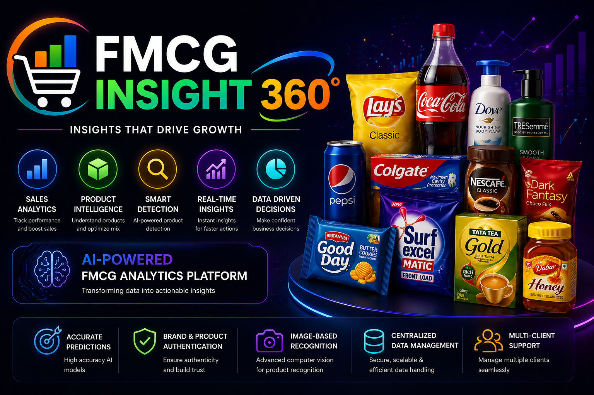
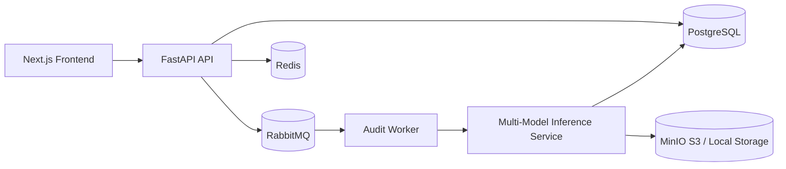

# FMCG Insight 360

<p align="center">
	
</p>

<p align="center">
	
</p>

<p align="center">
	
	
	
	
	
	
	
</p>

<p align="center">
	<b>📦 Product Catalog Ops</b> · <b>🧠 Multi-Model AI Inference</b> · <b>⚡ Async Queue</b> · <b>📊 Audit Analytics & Exports</b>
</p>

<p align="center">
	<b>Enterprise-grade FMCG shelf audit platform for product visibility, multi-model YOLO inference, and operations control.</b>
</p>

---

## 🚀 Quick Start Guide

### 🐳 Method 1: Running with Docker Compose (Recommended)

Run the entire microservices stack (Next.js Frontend, FastAPI Backend, Worker, PostgreSQL, RabbitMQ, Redis, MinIO, Prometheus, Grafana, Loki) with a single command:

#### 1. Clone the Repository
```bash
git clone https://github.com/VijayRajput4455/FMCG-Insight-360.git
cd FMCG-Insight-360
```

#### 2. Start the Stack
```bash
docker compose up --build -d
```

#### 3. Access Application Services

Once the containers are started, access the services in your browser:

| Service | Access URL | Credentials / Notes |
|---|---|---|
| 🖥️ **Next.js Operations Console** | [http://localhost:3000](http://localhost:3000) | Main User Dashboard & Audit App |
| ⚡ **FastAPI Swagger Docs** | [http://localhost:8000/docs](http://localhost:8000/docs) | Interactive OpenAPI Documentation |
| 🪣 **MinIO S3 Console** | [http://localhost:9001](http://localhost:9001) | User: `minioadmin` \| Pass: `minioadmin` |
| 🐰 **RabbitMQ Management** | [http://localhost:15672](http://localhost:15672) | User: `guest` \| Pass: `guest` |
| 📊 **Grafana Monitoring** | [http://localhost:3001](http://localhost:3001) | User: `admin` \| Pass: `admin` |
| 📈 **Prometheus Metrics** | [http://localhost:9090](http://localhost:9090) | System Performance Metrics |

#### 4. Rebuilding / Fresh Reset (If Needed)
To perform a complete clean build and clear cached database volumes:
```bash
docker compose down -v --remove-orphans
docker compose up --build -d
```

---

### 💻 Method 2: Running Locally (Manual Development Setup)

If you want to run the backend and frontend services locally on your host machine for development:

#### Prerequisites
- **Python**: 3.10 or higher
- **Node.js**: 18.x or higher (`npm` included)
- **Services**: Running PostgreSQL, RabbitMQ, and Redis instances (or start them via Docker)

#### 1. Backend Setup (FastAPI & Worker)

1. **Create and Activate a Virtual Environment**:
   ```bash
   # Windows (PowerShell)
   python -m venv venv
   .\venv\Scripts\Activate.ps1

   # Linux/macOS
   python3 -m venv venv
   source venv/bin/activate
   ```

2. **Install Python Dependencies**:
   ```bash
   pip install -r requirements.txt
   ```

3. **Configure Environment Variables**:
   Copy `.env` and verify database and Redis configuration:
   ```bash
   cp .env.example .env  # Or use existing .env
   ```

4. **Start FastAPI Backend Server**:
   ```bash
   uvicorn app.main:app --host 0.0.0.0 --port 8000 --reload
   ```

5. **Start Background Audit Worker** (In a separate terminal):
   ```bash
   python -m app.workers.worker
   ```

#### 2. Frontend Setup (Next.js 14)

1. **Navigate to the Frontend Directory**:
   ```bash
   cd frontend
   ```

2. **Install Dependencies**:
   ```bash
   npm install
   ```

3. **Start Development Server**:
   ```bash
   npm run dev
   ```

4. **Open Browser**:
   Open [http://localhost:3000](http://localhost:3000) to view the Operations Console.

---

## 🎯 Overview & Key Features

FMCG Insight 360 automates retail shelf auditing, product compliance checks, and inventory scanning:

1. **🧠 Multi-Model AI Pipeline**:
   - Assign multiple YOLO neural network models to a single Product Code (e.g. general classifier + brand-specific reader).
   - Sequentially executes inference across all models, merges bounding box detections with same-class NMS deduplication (`IoU threshold = 0.40`), and renders all predictions onto **one single output image**.

2. **📊 Audit Report Export Modal**:
   - Download complete operational audit logs in **CSV** or **JSON** formats.
   - Filter exports by custom date range, SKU search, status (`completed`, `failed`), and include direct S3/local image URLs.

3. **⚙️ Interactive Settings & Appearance Console**:
   - Live AI confidence threshold and NMS IoU threshold controls.
   - 4 Theme Swatches (Emerald Green, Crimson Red, Royal Blue, Warm Orange) with theme-accented iOS toggle switches.
   - Real-time API connection ping health check and local cache management.

4. **📈 Dynamic Time Window Filtering**:
   - Filter Dashboard KPIs and Analytics graphs seamlessly across `📅 This Week`, `🗓️ This Month`, and `📊 This Year`.

5. **🪣 Hybrid Storage (MinIO S3 + Local Disk Fallback)**:
   - Uploaded input images and annotated output images are saved directly to S3 MinIO buckets (`fmcg-audit-inputs`, `fmcg-audit-outputs`).
   - Automatically falls back to local disk storage (`uploads/` and `outputs/`) when running without MinIO.

---

## 🧠 Architecture


```mermaid
flowchart LR
	WEB[Next.js Frontend] --> API[FastAPI API]
	API --> DB[(PostgreSQL)]
	API --> RMQ[(RabbitMQ)]
	API --> REDIS[(Redis)]
	RMQ --> WORKER[Audit Worker]
	WORKER --> MODEL[Multi-Model Inference Service]
	MODEL --> MINIO[(MinIO S3 / Local Storage)]
	MODEL --> DB
```

### Operational Workflow:
1. **Request Submission**: Client submits a shelf image via file upload or image URL.
2. **Task Queueing**: FastAPI validates input parameters and publishes the audit task to RabbitMQ.
3. **Multi-Model Inference**: The audit worker retrieves active models mapped to the SKU, runs inference sequentially, applies IoU box merging, and annotates the image.
4. **Persistence & Caching**: Audit metrics are persisted in PostgreSQL, result artifacts are saved to MinIO/disk, and responses are cached in Redis.
5. **Real-time Monitoring**: Next.js console receives live status updates and renders detection graphs.

---

## 🧱 Technology Stack

| Layer | Technology |
|---|---|
| **API Framework** | FastAPI, Uvicorn, Pydantic v2 |
| **Database** | PostgreSQL 15, SQLAlchemy 2 |
| **Message Queue** | RabbitMQ, Pika |
| **Caching** | Redis 7 |
| **Object Storage** | MinIO S3 Object Storage / Local Storage |
| **Machine Learning** | Ultralytics YOLOv8 / YOLOv11, OpenCV, PyTorch |
| **Frontend Framework** | Next.js 14 (App Router), React 18, TypeScript |
| **Styling** | Vanilla CSS Tokens, Theme Switcher, Responsive CSS Grid |
| **Monitoring** | Prometheus, Grafana, Loki, Promtail |

---

## 🗂️ Repository Layout

```text
FMCG-Insight-360/
├── .env                    # System environment configuration
├── Dockerfile              # Production FastAPI / Worker container spec
├── docker-compose.yml      # Orchestration for all 10 microservices
├── requirements.txt        # Python backend dependencies
├── resources/              # Branding and documentation assets
├── ml_models/              # Neural network weights and model configs
├── app/                    # FastAPI Backend Application
│   ├── api/v1/             # Endpoint routes (audit, models, product_codes, products)
│   ├── core/               # Database, Redis, logger, and configuration
│   ├── models/             # SQLAlchemy ORM models
│   ├── repositories/       # Database access layers
│   ├── services/           # Inference pipeline, MinIO, and audit logic
│   └── workers/            # RabbitMQ background worker process
└── frontend/               # Next.js 14 Operations Console
    ├── src/
    │   ├── app/            # App router pages (dashboard, analytics, settings, audit, etc.)
    │   ├── components/     # UI Components (AuditConsole, ExportModal, SKU Managers)
    │   └── lib/            # API client and WebSocket handlers
    └── package.json
```

---

## 📋 First Audit Checklist

Follow these 4 simple steps to run your first automated shelf audit:

1. **Create a Product Code**:
   - Go to **Product Codes** (`http://localhost:3000/product-codes`).
   - Click **Create Code** (e.g. `PC-SNACKS-01`).

2. **Register a Model**:
   - Go to **AI Models** (`http://localhost:3000/models`).
   - Register a YOLO model weights file (e.g. `yolo26m.pt`) and map it to `PC-SNACKS-01`.

3. **Map Product SKUs**:
   - Go to **Products** (`http://localhost:3000/products`).
   - Add product items under `PC-SNACKS-01` (e.g. `Lays Chips`, `Doritos`).

4. **Submit an Audit**:
   - Go to **New Audit** (`http://localhost:3000/new-audit`).
   - Select `PC-SNACKS-01` and upload a shelf photo or paste an image URL.
   - Click **Run Audit Scan** and view instant detection counts and annotated images!

---

## 🔌 API Reference Highlights

FastAPI provides full interactive swagger documentation at `http://localhost:8000/docs`:

- **`POST /api/v1/audit/by-code/upload`**: Submit an audit scan via file upload.
- **`POST /api/v1/audit/by-code`**: Submit an audit scan via image URL.
- **`GET /api/v1/audit/{audit_id}`**: Fetch detailed audit status and detection coordinates.
- **`GET /api/v1/audit`**: Search and list historical audits with pagination.
- **`GET /api/v1/product-codes`**: List registered Product Codes and mapped SKUs.
- **`GET /api/v1/models`**: List registered YOLO neural network models.

---

## 📄 License

This project is licensed under the MIT License - see the LICENSE file for details.
